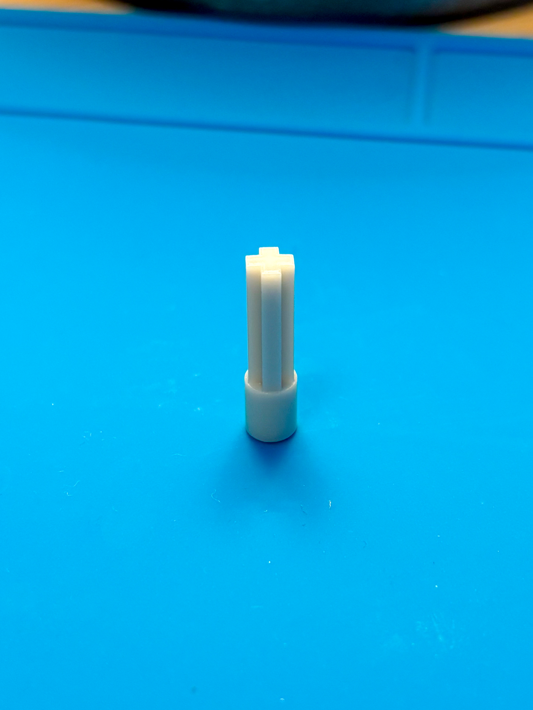
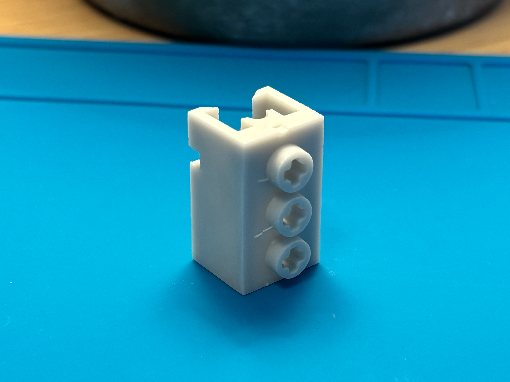
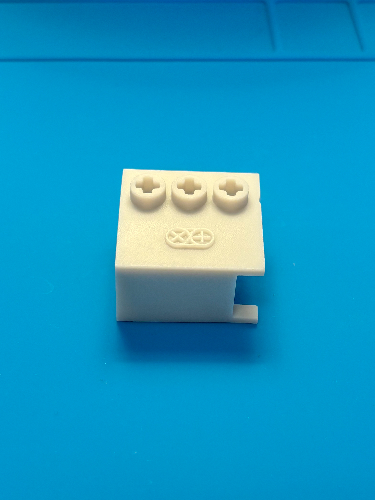

# Motor mechanical integration

How the two motors tie into the LEGO 42212 chassis: the GA12-N20 drive motor at the rear, and the SG90 steering servo at the front. Adapter and bracket part details live in [3d-printing/](3d-printing/README.md); this doc covers the surrounding integration and the mechanical compliance that affects control.

## Drive motor (N20)

The N20's rotation reaches the rear wheels through three stages, each adding some compliance worth being aware of when interpreting motor-side encoder data.

### Chain

1. **N20 D-shaft** drives the [3D-printed coupler](3d-printing/ga12-n20/README.md), which presents a LEGO Technic axle on its output side.
2. A **knob gear** on that axle meshes with a second knob gear on a perpendicular axle — the 90° change of direction.
3. The perpendicular axle carries a **small gear at each outer end**, each meshing with a **larger gear on a wheel shaft**. The size mismatch is a speed reduction: wheels turn slower than the perpendicular axle with proportionally more torque.

*Printed coupler: LEGO Technic axle profile on top, motor socket at the base.*

*The D-shaped bore that press-fits onto the N20's D-shaft.*

*Printed bracket: studs on top, Technic pin holes on the side, open motor cradle.*

*Assembled: motor in the cradle, shaft coupler on the output, power leads exiting the open end.*

*Underside view showing the motor seated in the cradle.*

*The N20 in its printed bracket: the coupler's LEGO axle drives the first knob gear, which meshes with a second on the perpendicular axle.*

*Wider view of the rear drive: coupler → knob gears → perpendicular axle running across the chassis.*

## Steering servo (SG90)

TBD — to document: servo mounting location in the chassis, the [3D-printed adapter](3d-printing/sg90/README.md) from servo horn to LEGO Technic axle, the linkage to the steering arm, and the asymmetry / compliance sources that motivate the firmware trim. The photos below show the current build.

*Printed mount that clips the SG90 to a LEGO stud row.*

*The servo in its bracket, with the spline-to-axle adapter on the output and the 3-pin lead exiting the side.*

*The adapter's LEGO axle drives the steering knob gear.*

*Wider view of the front steering linkage on the chassis.*

Firmware-side calibration (`kServoSide`, `kSteeringTrim`) is documented in [steering-calibration.md](steering-calibration.md).
