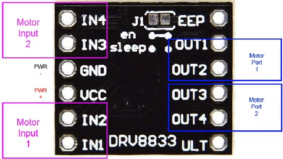

# N20 + DRV8833 bench test

Second bench test: spin the N20 motor through the DRV8833, still on USB power. Done after the [servo test](servo-breadboard-setup.md).

## You need

- ESP32-C3 board + USB-C cable
- Breadboard and jumper wires
- DRV8833 breakout
- One GA12-N20 motor

Leave the 18650 pack and the MP1584EN out for this step. The servo can be left disconnected for a clean motor-only test.

## Pins and wires

The firmware uses one half of the DRV8833 (channel A):

| ESP32-C3 | DRV8833 |
|---|---|
| GPIO 4 | IN1 (or AIN1) |
| GPIO 5 | IN2 (or AIN2) |
| 5V / VBUS | VM |
| GND | GND |

Motor leads go to **OUT1** and **OUT2** (or AOUT1/AOUT2). If the motor spins the wrong way, swap them.

If your DRV8833 breakout exposes `nSLEEP` / `SLP`, tie it high. Most breakouts do this on the board already.

## Procedure

1. Wire as above. Confirm grounds are shared and the motor leads are on OUT1/OUT2 only.
2. Plug the ESP32-C3 into your laptop and flash the firmware.
3. Start the keyboard bridge ([../README.md](../README.md#quick-start)).
4. Tap **W** and **S** briefly. Keep the motor unloaded and don't hold the key down.

## Expected

- **W** spins one direction, **S** the other, key release stops the motor.

## If it misbehaves

- **Motor doesn't spin** — check VM has 5 V, grounds shared, IN1/IN2 on GPIO 4/5, motor on OUT1/OUT2, and the keyboard bridge is actually sending commands.
- **ESP32-C3 resets** — USB can't supply the inrush. Disconnect the servo, keep the motor unloaded, use short bursts. The proper fix is the buck + battery setup later.

## Why USB power is fine here, but not for driving

USB delivers ~500 mA. That's enough for unloaded short bursts but nowhere near the N20's stall current (~1.5 A). Once the car is mechanically loaded you must move motor power to the 18650 pack via the [buck stage](buck-breadboard-setup.md).

For an editable wiring diagram: [n20-breadboard-setup.drawio](n20-breadboard-setup.drawio).

Next: [buck converter bench test](buck-breadboard-setup.md).
