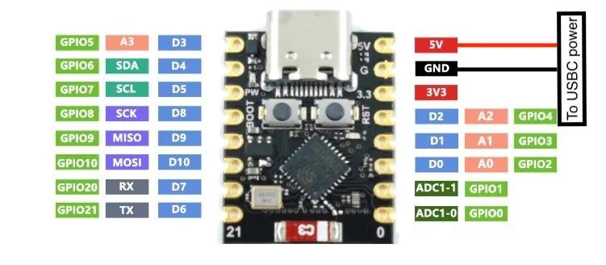
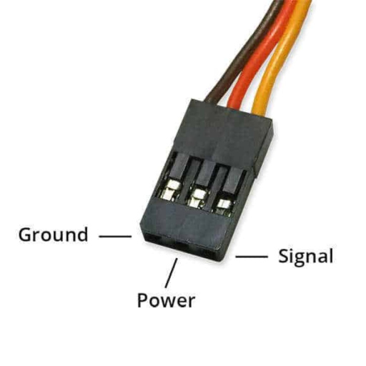

# Servo bench test

First and simplest test: drive the SG90 from a USB-powered ESP32-C3, no motor driver, no battery.

## You need

- ESP32-C3 board + USB-C cable
- Breadboard and jumper wires
- SG90 servo (or MG90 / EMax ES08 equivalent)

Leave everything else (DRV8833, N20 motor, buck, batteries) out of this step.

## Pins and wires

> [!WARNING]  
> Please be very careful on power pin connections to servo. If you accidentally wire GND and 5V pins in reverse, your poor SG90 will burn itself down in couple of seconds.

| Servo wire | Goes to |
|---|---|
| Orange / yellow (signal) | ESP32-C3 **GPIO 6** |
| Red (+5 V) | ESP32-C3 **5V / VBUS** |
| Brown / black (GND) | ESP32-C3 **GND** |

Run the servo's red wire to **5 V**, never to 3V3 and never directly to a GPIO.

## Procedure

1. Wire the servo as above.
2. Plug the ESP32-C3 into your laptop. Flash the firmware.
3. Start the keyboard bridge ([../README.md](../README.md#quick-start)).
4. Press **A** and **D** to steer left/right. Don't press W/S — no drive motor is wired yet.

## Expected

- Servo centers at startup.
- **A** / **D** move it to each side; releasing returns it toward center.

## If it misbehaves

- **Servo doesn't move** — check 5 V on the red wire, common ground with the ESP32, signal on GPIO 6, and that the keyboard bridge actually connected.
- **ESP32-C3 resets when the servo moves** — USB can't supply the current spike. Detach the horn so the servo is unloaded for this test, or move the servo to a separate 5 V supply later (keep grounds shared).

For an editable wiring diagram: [servo-breadboard-setup.drawio](servo-breadboard-setup.drawio).

Once this is stable, continue to the [N20 + DRV8833 bench test](n20-breadboard-setup.md). After the servo is connected to the steering linkage on the chassis, see [steering calibration](steering-calibration.md) to tune `kServoSide` and `kSteeringTrim`.
